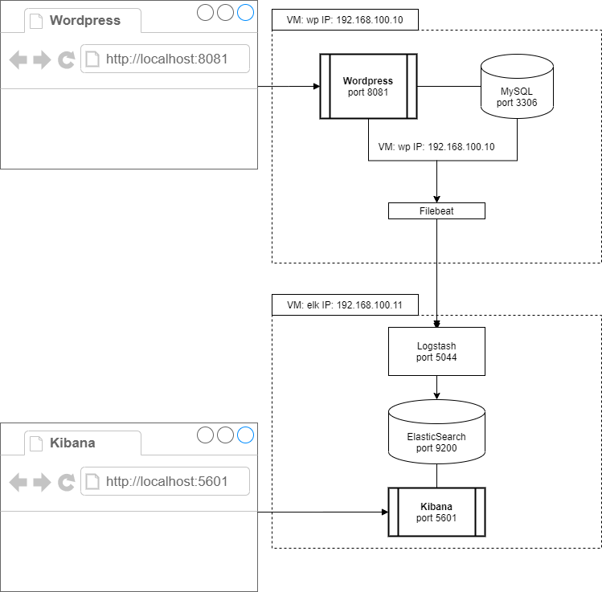

# Vagrant box to deploy Wordpress & ELK into two Ubuntu VMs



This vagrant box installs Wordpress, ELK Stack v7.10.0 (Elasticsearch, Logstash, and Kibana) and Filebeat.

## Prerequisites

- [VirtualBox](https://www.virtualbox.org/)
- [Vagrant](http://www.vagrantup.com/)

## Up and SSH

Edit this files to set the passwords and IPs:

- install_wordpress.sh
- install_filebeat.sh
- install_logstash.sh

To start the vagrant box run:

    vagrant up

To access consoles of the machines run:

    vagrant ssh elk

or:

    vagrant ssh wp

## Exposed ports

- Wordpress http://localhost:8081
- Elasticsearch http://localhost:9200
- Kibana http://localhost:5601

## Wordpress

Wordpress has been installed following [this setup](https://ubuntu.com/tutorials/install-and-configure-wordpress).

## Kibana

In Kibana you can create an index pattern with:

    filebeat-*

### Test Filebeat

If Filebeat does not work, you can test it if you want, accessing with ssh to wp virtual machine with:

```sh
vagrant ssh wp
cd /etc/filebeat
sudo ./filebeat test config -e
```
